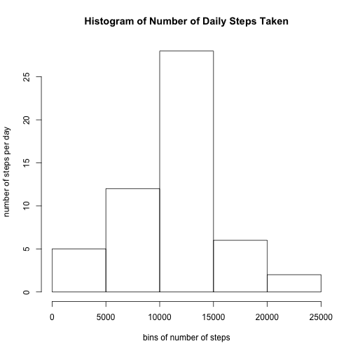
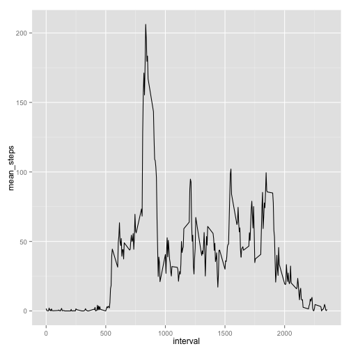
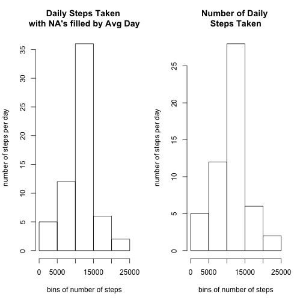
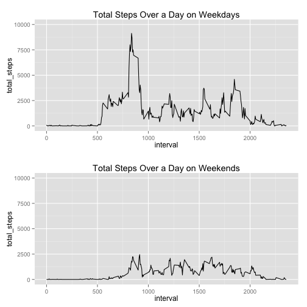

This study analyzes patterns in step data taken from a movement tracking device.
## Loading and preprocessing the data
The data as loaded and NAs were removed.


## What is mean total number of steps taken per day?
To answer this question, roll up the data to the date level, and then summarise.

```r
agg.df <- activity.df.cc %>% 
        group_by(date)%>%
        arrange(date,interval)%>%
        summarize(sum_steps = sum(steps), 
                  mean_steps=mean(steps), 
                  median_steps = median(steps)
                  )
hist(agg.df$sum_steps, 
     ylab="number of steps per day", 
     xlab="bins of number of steps", 
     main ="Histogram of Number of Daily Steps Taken")
```

 

```r
#kable(agg.df,digits=2)
```

## What is the average daily activity pattern?  
To answer this question, we started with the complete cases data set, and grouped by the interval column.  Next, the mean steps for each interval were caluclated and plotted.

```r
adp.df <- activity.df.cc %>% 
          group_by(interval) %>%
          summarise(mean_steps =mean(steps))

qplot(interval,mean_steps,data=adp.df,geom="line")
```

 

## Imputing missing values
Missing Values were assessed and substituted with the average value for the null interval.  While the pattern remains the same, it is clear that the number of steps is boosted by filling in the NAs with the average.

```r
par(mfrow=c(1,2))
#plot the total steps after
activity.df.fc <- merge(adp.df,activity.df, by="interval") %>% 
                mutate(nsteps=ifelse(is.na(steps),mean_steps,steps))

activity.day <- activity.df.fc  %>% group_by(date) %>%
                                summarize(total_n_steps=sum(nsteps))

hist(activity.day$total_n_steps , ylab="number of steps per day", 
     xlab="bins of number of steps", 
     main ="Daily Steps Taken \nwith NA's filled by Avg Day")

hist(agg.df$sum_steps, 
     ylab="number of steps per day", 
     xlab="bins of number of steps", 
     main ="Number of Daily \nSteps Taken")
```

 

## Are there differences in activity patterns between weekdays and weekends?
There is a clear observable pattern between weekends and weekdays


```r
activity.df.cc.wd <- activity.df.cc %>% 
        mutate(isweekday=ifelse(!(weekdays(date,TRUE) %in% c("Sat","Sun")),1,0)) %>%
        group_by (interval,isweekday) %>%
        summarise(total_steps = sum(steps))
p1<-ggplot(
        data=activity.df.cc.wd%>%filter(isweekday==1), 
        aes(x=interval,y=total_steps)) + geom_line()+ ylim(0,10000) +
        ggtitle("Total Steps Over a Day on Weekdays")

p2<-ggplot(
        data=activity.df.cc.wd%>%filter(isweekday==0), 
        aes(x=interval,y=total_steps)) + geom_line() + ylim(0,10000) +
        ggtitle("Total Steps Over a Day on Weekends")

multiplot(p1,p2)
```

 
